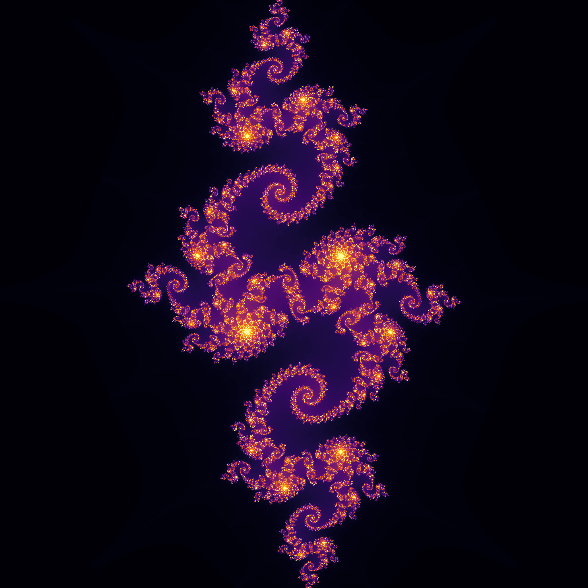

A numpy-based fractal image generator, with support for single images or animations.
Can generate [Julia sets](https://en.wikipedia.org/wiki/Julia_set) and variations on the
[Mandelbrot set](https://en.wikipedia.org/wiki/Mandelbrot_set).

main.py contains the script which will actually run it. It begins with the high-level parameters,
and should be modified to change the results. It then processes the high-level parameters into low-level
parameters which are used to run the mathematics behind the Julia set. These low-level parameters
can be directly edited if you want behaviors more complex than the defaults on the high-level parameters.

High-level parameters:

* Run type
  * run_type: String specifying what type of output we're producing. Options:
    * julia: a Julia set
    * mandelbrot: a Mandelbrot-like set. will ignore the 'param' variable seen below.
    * reanimate: recreates the gif from a folder of .pngs. Does not run any further calculations
  * folder: a folder for the output. optional except with run_type = 'reanimate'

* Display parameters
  * pixels: by default, fills in values for xpixels and ypixels
  * xpixels: how many pixels wide the images should be
  * ypixels: how many pixels tall the images should be
  * frames: how many frames to generate (if 1, will not animate)
  * seconds: how long the animation should be
  * colormap: MatPlotLib colormap that defines how to color the display. See https://matplotlib.org/stable/tutorials/colors/colormaps.html for more options and info. I like cm.inferno, cm.viridis, and cm.plasma; cm.prism is amusingly ugly.
  * color_by: String defining what data should be fed into the colormap. Options are:
    * iterations: color each point by how many iterations it lasted without diverging
    * diverged: how many iterations it took to diverge, or 0 if it didn't diverge
    * array: absolute value of each point (this will be the maximum value for any divergent point)
    * undiverged: absolute value of each undivergent point, or 0 for any divergent point
    * nested: how many iterations it took to diverge, or absolute value if it didn't diverge
  * normalize_frame_colors: Try to maintain consistent colors for specific data values between frames.
    If the number of steps varies between frames and you are displaying iterations, 
    having this as True will show undiverged points differently between different frames.

* Fixed simulation parameters
  * height: height of the viewing window in the complex plane. Width will be determined by the 
    ratio of xpixels to ypixels
  * center: center of the viewing window as a complex number
  * point_value_max: maximum absolute value at any point

* Variable simulation parameters
  * These can be fixed or vary by frame. If they vary, they will be linearly interpolated frame-by-frame unless stated otherwise
  * steps: how many steps to run for
  * zoom: the zoom of the window. smaller values of this mean zooming out; larger values mean zooming in. avoid 0
    * zoom_start: zoom at the first frame
    * zoom_end: zoom at the last frame
  * shift: how much the window should be shifted, as a complex number to be added to the center
    * shift_start: shift at the first frame
    * shift_end: shift at the last frame
  * power: sets `p` in the step equation `x^p + c`
    * power_start: power at the first frame
    * power_end: power at the last frame
  * param: sets `c` in the step equation `x^p + c`. can be set directly, or by radius and degrees. Will trace a circle around the origin if not fixed
    * param_radius: distance of param from origin. Available both in fixed and variable modes
    * param_degrees: degrees of param relative to the positive real numbers. Fixed mode only
    * param_degrees_center: optional way to set param_degrees_start and param_degrees_end. 
      Chooses the center point of the arc traced by param. requires param_degrees_range. Variable mode only
    * param_degrees_range: optional way to set param_degrees_start and param_degrees_end. Sets the range of the arc traced by param. requires param_degrees_center. Variable mode only
    * param_degrees_start: degrees of param at first frame. Variable mode only
    * param_degrees_end: degrees of param at last frame. Variable mode only
