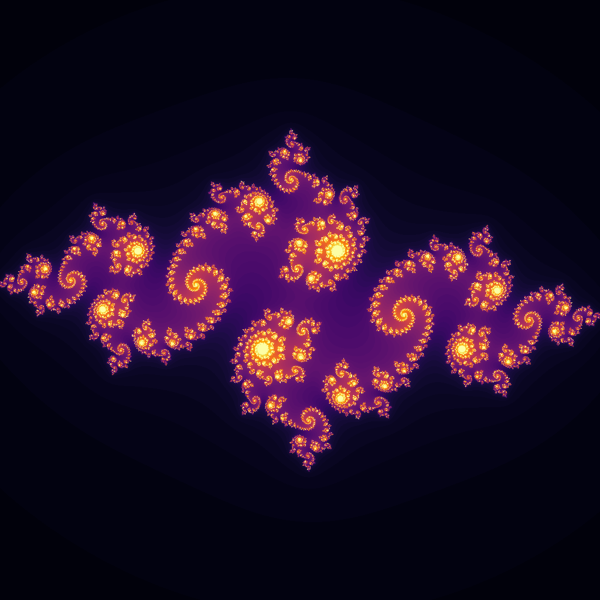

A numpy-based fractal image generator, with support for single images or animations.
Can generate [Julia sets](https://en.wikipedia.org/wiki/Julia_set) and variations on the
[Mandelbrot set](https://en.wikipedia.org/wiki/Mandelbrot_set).

To set this up, install [Python 3.10](https://www.python.org/downloads/release/python-31010/).
Then navigate to this folder and run the command `python -m pip install -r requirements.txt` to install
all required libraries.

To test it out, try `python main.py default` to use the options in /configs/default.yaml.
Check out the yaml files in /configs for more examples of how it can be configured.
variable.yaml has some annotations to explain how variable parameters work with animations.
More formal information is below.

The most important factors for performance are the size of the image (the `pixels` parameter is quadratic),
the number of frames (linear), and the number of steps (linear).
All frames are generated simultaneously, but steps are performed sequentially.
Non-integer values of `power` will run somewhat slower than integers. Variable parameters may also run a bit slower.

usage: `python main.py [-h] [--random] [FILE]`

positional arguments:
  * FILE          optional; either a path to a YAML config file, or the name of a file within the /configs folder. 
                  For files within /configs, the extension can be omitted, e.g. `default` or `spires` (with no .yaml).

options:
  * -h, --help    show a help message and exit
  * --random, -r  generate a random config file (with the filename specified by FILE or random.yaml if none)

If no configuration file is provided and `--random` is not used, it will prompt for a config file. 
The config used for a given run will be stored in its output folder, so it can be moved into the configs folder
to recreate that run if the original config file has changed or no longer exists.

Config parameters:

* Run parameters
  * run_type: String specifying what type of output we're producing. Options:
    * julia: generate a Julia set (ex: default.yaml)
    * mandelbrot: generate a Mandelbrot-like set (ex: mandelbrot.yaml). Will ignore the 'param' variable seen below
    * reanimate: recreate the gif from a folder of .pngs (ex: reanimate.yaml) with a specified number of seconds.
      Requires folder to be set. Ignores all parameters except folder and seconds as it does not generate new images.
  * folder: path to a folder for the output (or input of 'reanimate' runs).
            Optional except with run_type 'reanimate'.

* Display parameters
  * pixels: integer by default, fills in values for xpixels and ypixels. Alternative parameters are:
    * xpixels: how many pixels wide the images should be
    * ypixels: how many pixels tall the images should be
  * frames: integer, how many frames to generate (if 1 or unset, will not animate)
  * seconds: float, how long the animation should be. Defaults to frames / 24 with a minimum of 1 second
  * colormap: string, name of a MatPlotLib colormap that defines how to color the display.
    See https://matplotlib.org/stable/tutorials/colors/colormaps.html for more options and info. 
    I like inferno, viridis, and plasma; prism is amusingly ugly
  * color_by: string, specifies what data should be fed into the colormap. Options are:
    * iterations: color each point by how many iterations it lasted without diverging
    * diverged: how many iterations it took to diverge, or 0 if it didn't diverge
    * value: absolute value of each point (this will be the maximum value for any divergent point)
    * undiverged: absolute value of each undivergent point, or 0 for any divergent point
    * nested: how many iterations it took to diverge, or absolute value if it didn't diverge
  * normalize_frame_colors: True/False, whether to try to maintain consistent colors for 
    specific data values between frames.
    If the number of steps varies between frames and color_by is 'iterations',
    having this as True will show undiverged points differently between different frames

* Fixed simulation parameters
  * height: float, height of the viewing window in the complex plane. If you want this to change in the animation, use zoom
  * width: float, width of the viewing window. Defaults to height times the ratio of xpixels to ypixels
  * center: complex number, center of the viewing window. If you want this to change in the animation, use shift
  * point_value_max: float, maximum absolute value at any point. Any value of 2 or greater ensures relatively normal behavior

* Variable simulation parameters
  * These can be fixed or vary by frame. If they vary, they will be linearly interpolated frame-by-frame unless stated otherwise.
  * steps: integer, how many steps to run for. Alternative parameters are:
    * steps_start: steps to run for the first frame
    * steps_end: steps to run for the last frame
  * zoom: float, the zoom of the window. Smaller values of this mean zooming out; larger values mean zooming in
    Must be positive. Alternative parameters are:
    * zoom_start: zoom at the first frame
    * zoom_end: zoom at the last frame
  * shift: complex number, how much the window should be shifted (will be added to center). Alternative parameters are:
    * shift_start: shift at the first frame
    * shift_end: shift at the last frame
  * power: float, `p` in the step equation `x^p + c`. Alternative parameters are:
    * power_start: power at the first frame
    * power_end: power at the last frame
  * param: complex, `c` in the Julia set step equation `x^p + c`. Not applicable to Mandelbrot sets.
    Alternative parameters are:
    * param_start: value of `c` at the first frame (incompatible with polar coordinates)
    * param_end: value of `c` at the last frame (incompatible with polar coordinates)
    * param_radius: float, distance of `c` from the origin for polar coordinates.
      * param_radius_start: radius at the first frame
      * param_radius_end: radius at the last frame
    * param_degrees: float, degrees of `c` relative to the positive real numbers for polar coordinates (90 imaginary, 180 negative, etc.).
      * param_degrees_start: degrees of `c` at first frame
      * param_degrees_end: degrees of `c` at last frame
